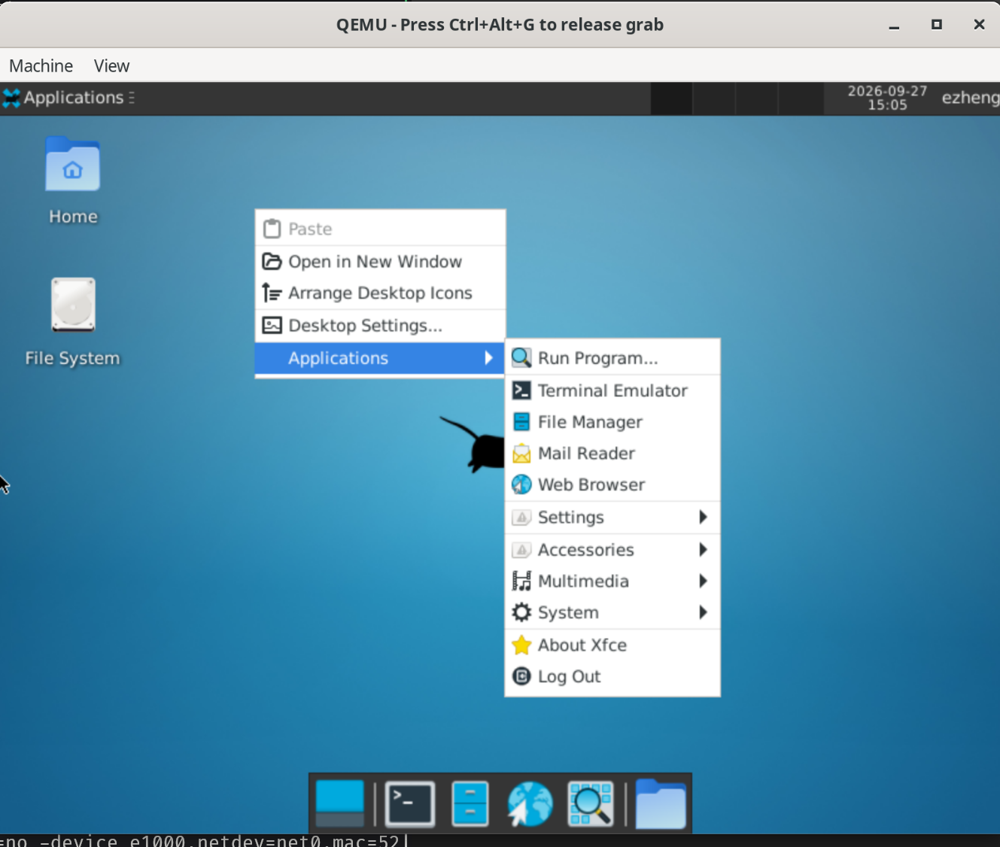

# GNU/MOS

GNU/MOS builds 32-bit x86 and 64-bit x86 operating systems with the [MOS kernel](https://github.com/crazygeme/mos), GNU userspace, and an Xfce desktop. Package recipes compile the toolchain, system utilities, libraries, and applications from source, assemble a target sysroot, and install it into a GRUB-bootable disk image for QEMU.



## System overview

- **Architectures:** `x86` uses i686 userspace and `i686-lfs-linux-gnu`; `x64` uses x86-64 userspace and `x86_64-lfs-linux-gnu`. The default architecture is `x64`.
- **Core system:** MOS, glibc, GNU utilities, Bash, SysV init, and GRUB.
- **Desktop:** Xorg, XDM with PAM authentication, and Xfce with Thunar and xterm.
- **Applications:** Mousepad, MATE System Monitor, MATE Calculator, and FFplay in the desktop profile; FFmpeg and FFprobe in both profiles.
- **Networking:** an emulated e1000 adapter with host-provided DHCP, DNS, and IPv4 NAT.

The desktop profile starts graphical login in runlevel 5. The console profile starts in runlevel 3. Package versions, source locations, and build order are defined in the individual `src/packages/*/package.json` manifests.

## Host requirements

The build recipes target an x86-64 Linux host. Image setup executes installed target programs. The x86 profile requires host support for 32-bit x86 execution; the x64 profile requires x86-64 execution.

Host tools include Bash, Python 3 with `tarfile` extraction-filter support, Git, a native C/C++ compiler, GNU Make, patch, archive utilities, and the build utilities required by individual package recipes. Host development dependencies depend on the selected packages. Before building a package with declared APT host dependencies, `./lfs build` installs missing distribution packages through `apt-get`, using `sudo` when required. Installed dependencies do not trigger installation or authentication.

Image installation requires `sudo`, `qemu-img`, `sfdisk`, `losetup`, `mkfs.ext3`, and mount utilities. The console launcher requires the host `qemu-system-x86_64`. Both launch profiles require access to KVM, `ip`, `sysctl`, `iptables`, and `dnsmasq`. Privileged operations use `sudo` to manage loop devices, mounts, and host networking.

The GUI profile builds QEMU 10.2.1 through `qemu-host`, installs it in `.workspace/<arch>/tools/qemu`, and uses that executable for desktop launches. Its SDL refresh path preserves active OpenGL scanout. The desktop launcher uses `virtio-vga-gl` with `-display sdl,gl=on,full-screen=on`. The window starts in borderless desktop fullscreen mode at the host desktop resolution. PS/2 relative-pointer movement is forwarded without window scaling, preserving small movements in both windowed and fullscreen modes. `Ctrl+Alt+F` toggles fullscreen mode. The host graphics driver must provide hardware-accelerated OpenGL. An explicit `-display` argument overrides the default display backend and fullscreen setting.

The launcher provides an AC97 sound card using QEMU's SDL audio backend.
`MOS_AUDIO_BACKEND` selects another backend supported by the configured QEMU
executable. Explicit `-audio` or `-audiodev` arguments replace the default audio
configuration and must include the required guest sound device. MOS exposes
AC97 playback through `/dev/dsp`; the XFCE session defaults SDL applications to
the `dsp` audio driver. An explicit `SDL_AUDIODRIVER` value overrides that default.

The `qemu-host` recipe links against native host development libraries. On Debian or Ubuntu, `./lfs build` checks and installs the following dependencies before preparing the QEMU source. Installation may require a sudo password. The equivalent manual command is:

```sh
sudo apt install pkg-config libsdl2-dev libvirglrenderer-dev libgbm-dev libdrm-dev libepoxy-dev libglib2.0-dev libpixman-1-dev zlib1g-dev python3-venv
```

The recipe requires SDL, OpenGL, and VirGL support during configuration. Host QEMU installation does not require copying files into the guest image.

## Build and run

Run commands from the repository root. To build the desktop system, install the image, and start the virtual machine:

```sh
./lfs build --all
./lfs setup
./lfs run
```

To build and install the console profile:

```sh
./lfs build --no-gui
./lfs setup --no-gui
./lfs run
```

Within each architecture, both profiles share `.workspace/<arch>/sysroot/`, build artifacts, host tools, and `.workspace/<arch>/qemu-hd/lfs.img`. The console build excludes packages marked with the `gui` profile; it does not remove GUI files already installed in the shared sysroot. `setup --no-gui` reformats the image partition and selects runlevel 3. Files stored only in that image partition are removed.

`./lfs run` boots the installed image configuration. Its `--no-gui` option does not change the image's runlevel or disable the QEMU display. The GRUB entry **LFS on MOS (console)** selects runlevel 3 independently of the configured default.

### Architecture selection

`--arch x86|x64` selects the architecture for `build`, `setup`, `status`, and
`run`. Commands without `--arch` select `x64`; `--arch x86` selects the x86 workspace. The option is accepted before or after the subcommand. Source archives
and the MOS checkout are shared under `.workspace/sources/`; each architecture
has its own sysroot, tools, completion records, caches, logs, mount directory,
and disk image under `.workspace/<arch>/`. Source fetching uses a shared lock, preventing duplicate downloads during
concurrent architecture builds. Go module sources use `.workspace/sources/go-modules/`.

```sh
./lfs build --arch x64 --all
./lfs setup --arch x64
./lfs run --arch x64
./lfs status --arch x86
```

Commands operate directly on `.workspace/<arch>/`. Host tools are compiled
with installation paths for the selected architecture. Completion versions
control package rebuild selection.
`stats` is an alias for `status`.

The x64 sysroot uses `/usr/lib` for libraries, with `/lib64` and `/usr/lib64`
aliases for the x86-64 ABI. MOS installs the x86 ELF kernel or the x64 flat
Multiboot image as `/boot/kernel`. Both architectures use BIOS GRUB `i386-pc`.

### Build control

Bash completion is installed automatically when `./lfs` is executed. The launcher
links `completions/lfs.bash` into
`${XDG_DATA_HOME:-$HOME/.local/share}/bash-completion/completions/lfs`.
When `BASH_COMPLETION_USER_DIR` is configured, its first nonempty directory is
used with the `completions/lfs` suffix. Existing files and links are preserved;
installation failures do not interrupt the requested command.

With `bash-completion` enabled in the interactive shell, completion loads on
demand for `./lfs` and `lfs` without a separate installation command or manual
`source`. Completion provides subcommands and their options, omits options
already present, and uses filename completion for QEMU arguments after
`./lfs run --`.

| Command | Behavior |
| --- | --- |
| `./lfs status` | Display configured package versions, source/build state, and image presence. |
| `./lfs status --no-gui` | Display state for the console package selection. |
| `./lfs build` | Build the next package with a missing or outdated completion artifact. |
| `./lfs build --all` | Build all pending packages in manifest order. |
| `./lfs build --no-gui` | Build all pending console packages. |
| `./lfs build --all --rebuild` | Delete all completion markers and build all pending packages in manifest order. |
| `./lfs setup` | Copy system configuration, run postscripts for completed packages, and install the sysroot into the image. |
| `./lfs run` | Boot the image with QEMU and configure host networking for the session. |

Builds fetch missing sources automatically. Each package defines a positive integer build version in `src/packages/<package>/version`, independently of the upstream software version in `package.json`. Completion artifacts record this build version in their JSON `version` field. Both `status` and `build` consider a package built when its completion version is at least its configured build version. A missing artifact or an older completion version requires compilation. An existing artifact without a `version` field, including an empty artifact, is assigned the configured build version and remains built. Changes requiring recompilation must increment the affected package's build version. `--rebuild` deletes all `*.done` files recursively under `.workspace/<arch>/artifacts/` without prompting, then follows the normal build flow. The deletion preserves all other files. Normal package selection and stopping rules apply: the default builds one package, `--all` builds all pending packages, and `--no-gui` builds all pending console packages. All completion markers for the selected architecture are deleted even when `--no-gui` is selected.

FFmpeg, FFprobe, and FFplay are outputs of the single `ffmpeg` package.
The GUI profile builds all three together; the console profile omits FFplay.
The completion record identifies the built profile, so a console build is
pending when the GUI profile is selected.

Each package build starts with an empty `.workspace/<arch>/build/` directory. Package builds must run sequentially within each architecture workspace. Different architectures use separate build trees and installation paths. Build logs are written to `.workspace/<arch>/logs/<package>.log`.

Autoconf recipes retain successful configuration test results under
`.workspace/<arch>/configure-cache/<package>/`. Each configure invocation uses a cache
selected by its command, build directory, configure script, package files,
environment, compiler and tool metadata, explicit `CONFIG_SITE` contents, and
other installed package completion records. Native and cross configurations
use separate entries. A matching cache is restored into the fresh build tree;
configure still runs to generate Makefiles and configuration headers. Only
checks implemented with Autoconf cache variables reuse their results. Failed
configure invocations do not replace the persistent cache.

The configuration cache survives build-tree cleanup and `--rebuild`.
Changes to cache inputs select a separate entry. Host header or library changes
outside the package build workflow require removing
`.workspace/<arch>/configure-cache/` before configuration. Removing a package's cache
directory forces fresh checks for that package on its next build. Build systems
without Autoconf cache support, including QEMU and zlib, retain their own
configuration behavior.

### Image and virtual machine configuration

| Environment variable | Default | Purpose |
| --- | --- | --- |
| `LFS_IMAGE_SIZE` | `8G` | Raw disk size when `setup` creates a new image. |
| `LFS_RAM` | `4096` | Guest memory passed to QEMU with `-m`. |

The image uses a DOS partition table, one ext3 partition, and the GRUB `i386-pc` boot target. The launcher uses KVM, the host CPU model, two virtual CPUs, and an IDE disk. Serial output is written to `.workspace/<arch>/krn.log`.

The launcher sets `opt/org.seabios/pci64=0` through QEMU firmware configuration to keep PCI memory resources below 4 GiB, within the i686 kernel's device mapping range.

During execution, the launcher creates `lfs-tap0`, assigns the host address `10.0.6.1`, and serves the `10.0.6.0/24` subnet. It configures DHCP, DNS, forwarding, and NAT, then removes its network configuration when QEMU exits.

## Desktop and system configuration

XDM provides local graphical login on virtual terminal 2. Successful authentication starts Xfce under the selected system account; logging out returns to XDM. From a privileged guest shell, `telinit 3` stops graphical login and `telinit 5` starts it.

Xorg uses the modesetting driver with glamor and the Mesa VirGL driver. QEMU supplies a default preferred size of 2560 × 1440; the driver probes this size and exposes a preferred mode at a nominal 120 Hz with 24-bit color depth. Xfce display settings support runtime resolution changes. Rendering executes on the host GPU. The DRM implementation does not provide page-flip or vblank events; the advertised mode frequency does not guarantee a 120 FPS presentation rate. Presentation also depends on the host display and QEMU frontend.

The desktop provides `glxinfo`, `glxgears`, `eglinfo`, and `mos-gpu-info`. A zero video-memory value means that the queried capacity is unavailable when VirGL does not expose the corresponding host capability; it is not a measurement of allocated graphics memory. `mos-gpu-info` checks direct rendering and the renderer string. Shared graphics buffers use implicit synchronization between VirGL contexts.

System configuration resides in `src/sysroot/` and package `postscript.py` files. `./lfs setup` applies these files and postscripts before copying the sysroot into the image. Package postscripts configure services, desktop resources, and installation permissions.

System logs are stored in `/var/log/messages`, `/var/log/auth.log`, and `/var/log/kern.log`. Display-manager diagnostics are stored in `/var/log/xdm.log`, and desktop session output is appended to `~/.xsession-errors`.

## Repository layout

| Path | Contents |
| --- | --- |
| `lfs` | Command-line entry point. |
| `src/lfs.py` | Package orchestration, image installation, and QEMU launch logic. |
| `src/packages/` | Package manifests, build recipes, patches, and postscripts. |
| `src/package_lib.py` | Shared cross-compilation and package build helpers. |
| `src/sysroot/` | System configuration and filesystem overlay. |
| `docs/screen/` | System screenshots. |
| `.workspace/sources/` | Shared source archives and checkouts. |
| `.workspace/x86/`, `.workspace/x64/` | Architecture-specific build trees, host tools, sysroot, artifacts, caches, logs, and disk image. |

## Additional documentation

- [Package layout and system integration](src/packages/README.md)
- [MOS kernel package](src/packages/mos/README.md)
- [Xfce desktop and applications](src/packages/xfce/README.md)
